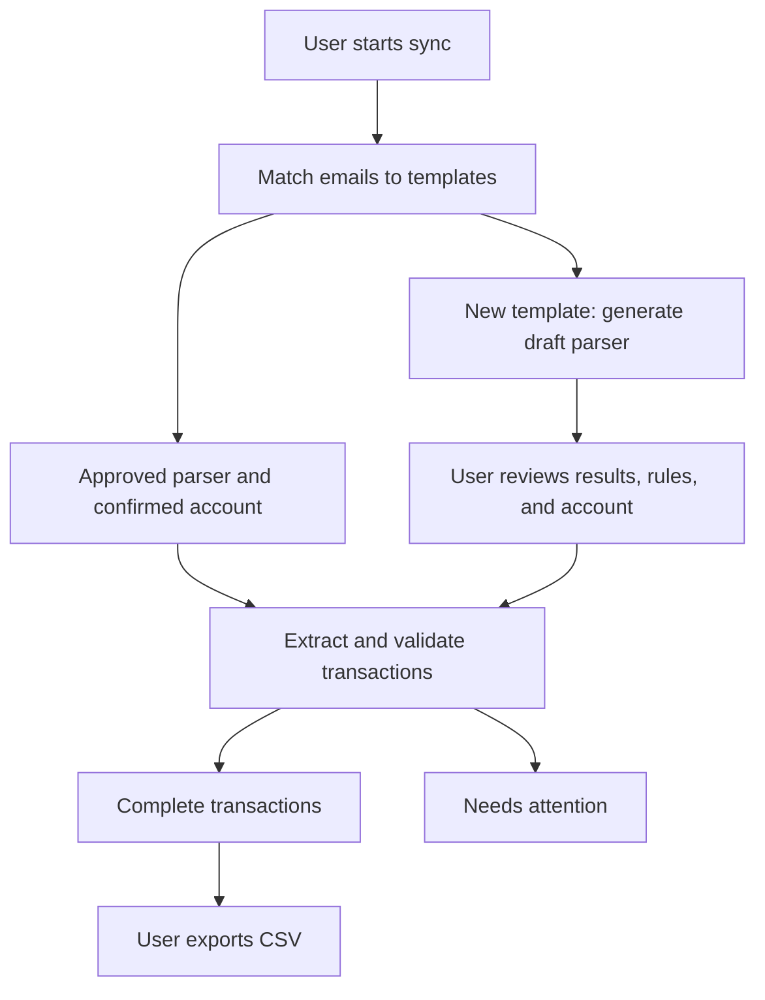

# UX: Sync, review exceptions, export transactions

Status: Accepted product specification

## Experience model

Design around three user activities: **Sync emails**, **Review what needs attention**, and
**Export transactions**. Matching, parser generation, and extraction run in the background.

Approval applies to a reusable parser version, so the user reviews a new email format once rather
than approving every transaction.

## User journey and information architecture

Use three primary destinations:

- **Transactions:** the default destination after setup. Browse completed transactions, filter by
  date, account, or credit/debit direction, inspect source evidence, and export.
- **Needs attention:** a persistent queue of parser reviews, unresolved accounts, and processing
  failures. Group shared problems by template and show how many emails each resolution will unblock.
- **Emails:** inspect imported messages and their processing status, with links to their template
  and resulting transaction.

Keep **Templates**, **Accounts**, and sync configuration available as supporting management
destinations. Users should not need to visit them sequentially to complete a run.

**First use:** explain the configured Gmail source, ask for the import start date, then offer
**Sync emails**. If credentials or configuration are missing, explain what must be configured.
Create financial accounts during review when first needed.

**Subsequent use:** remember the import settings and default to syncing from the last successful
sync's start date, allowing overlap without duplicate imports. Offer an explicit earlier date for
backfills.

Sync starts matching, draft generation, and eligible extraction automatically. Show meaningful
stage names and actual counts; do not invent percentage progress. Processing continues when the
user navigates away, and its status survives refresh.

At completion, report outcomes with links: transactions created, emails awaiting review, ignored
emails, and failures. Already imported emails are reported separately.

## Review and recovery behavior

The review unit is **one template's parser draft**, presented through its results.

Show the source email, proposed transaction, and the rule behind each field. Selecting a field
reveals the email parameter or constant that produced it. Label missing values explicitly. Show
normalized dates, amounts, and credit/debit direction exactly as they would appear in transactions.

Provide these actions:

- **Approve and process:** activate this parser version and process eligible waiting emails.
- **Edit rules:** choose an email parameter, ordered combination of parameters, constant, or explicit
  missing value; refresh previews without creating transactions.
- **Regenerate draft:** replace the draft, keeping any approved version intact.
- **Review later:** retain the draft and leave the item in the queue.
- **Ignore this template:** exclude matching emails from transaction processing until restored.

Preview up to five examples spanning oldest, newest, and different account hints; allow inspection
of every matching email. Validate the draft against all currently waiting emails and distinguish
"examples inspected" from "emails successfully validated." Approval requires a complete rule
configuration and at least one valid preview. Individual email failures remain in Needs attention
while valid emails proceed.

**Account selection is always the user's decision.** Display the account hint beside an account
selector and allow inline account creation. The user can explicitly remember a selection for that
template and exact hint. Never infer an account from the hint alone. New or absent hints require
assignment; conflicting hints must not inherit another account's selection. Changing a transaction's
account and remembering a mapping are separate actions.

Require account, amount, currency, transaction date, and credit/debit direction for a completed
transaction. Payee and description may be absent. Incomplete results stay in Needs attention and
outside normal export.

Failures should explain the affected email, field, reason, and available remedy. Retry only failed
or pending work. A failure in one email must not prevent valid emails from completing.

Editing approved rules creates a new draft. Approval activates the replacement for future
processing. Existing transactions remain unchanged unless the user explicitly chooses
**Reprocess existing transactions**, reviews the affected count and changes, and confirms replacement.
Record which parser version produced each transaction.

## Transactions and CSV export

Transactions are usable immediately after approved extraction; a second mandatory review is
unnecessary.

Transaction detail provides the source email, applied rules, confirmed account, and parser version.
Corrections lead to the responsible rule or account mapping, with an explicit choice about
reprocessing existing results.

Export offers **Selected transactions** or **All matching current filters**, with a record count that
includes results beyond the current page. Export uses a fixed snapshot of that selection.

CSV columns: transaction ID, transaction date, account, amount, currency, direction, payee,
description, account hint, and source email ID. Use ISO dates, exact decimal amounts, explicit
credit/debit values, and blank optional fields.

Downloading does not remove transactions or exclude them from future exports. Repeated export is
allowed; stable transaction IDs support downstream reconciliation.

## Required capabilities and acceptance criteria

Backend additions must support durable workflow status, draft and approved parser versions,
non-persisting multi-email previews, explicit approval, user-confirmed account mappings, ignored
templates, per-email processing outcomes, transaction provenance, controlled reprocessing, and
filtered CSV export. Existing generation must stop overwriting active rules. Approval must be
enforced by extraction itself.

Validate these journeys:

- First import generates drafts but creates no transactions from unapproved parsers.
- A repeat sync processes familiar formats automatically without duplicate transactions.
- Approval processes waiting emails; new account hints still require user selection.
- One malformed email leaves valid matching emails able to complete.
- Draft edits and regeneration do not alter active rules or existing transactions.
- Refreshing or leaving the page preserves job visibility and saved review progress.
- Ignored templates can be restored; incomplete results cannot enter normal export.
- Export includes the exact selected or filtered set across pagination.

Defaults: personal use, manually initiated Gmail sync, automatic downstream processing, CSV
download, and one transaction per email. Cross-email transaction deduplication and multi-transaction
statements are outside this first version.

The impeccable skill informed the task structure, review evidence, and recovery paths. This
specification makes no visual-design decisions and does not depend on the throwaway frontend.
